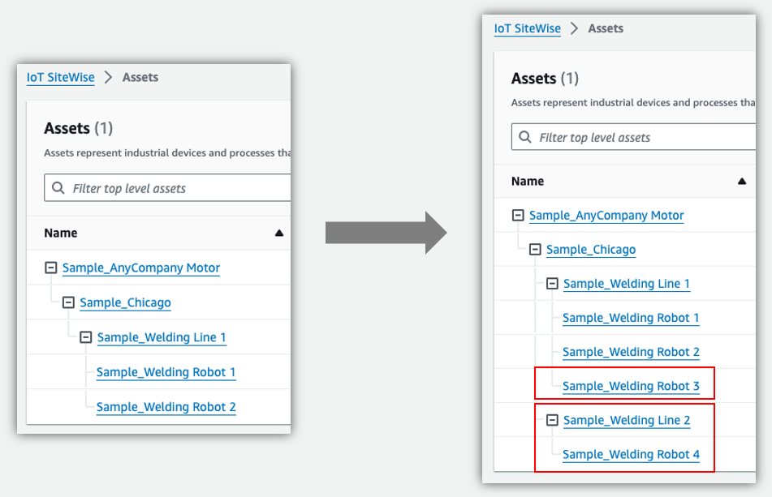
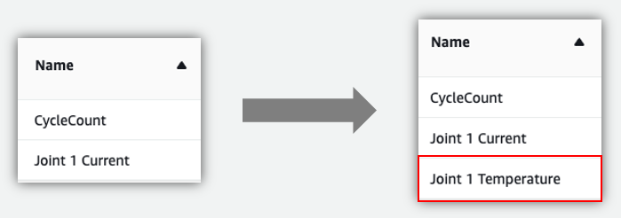
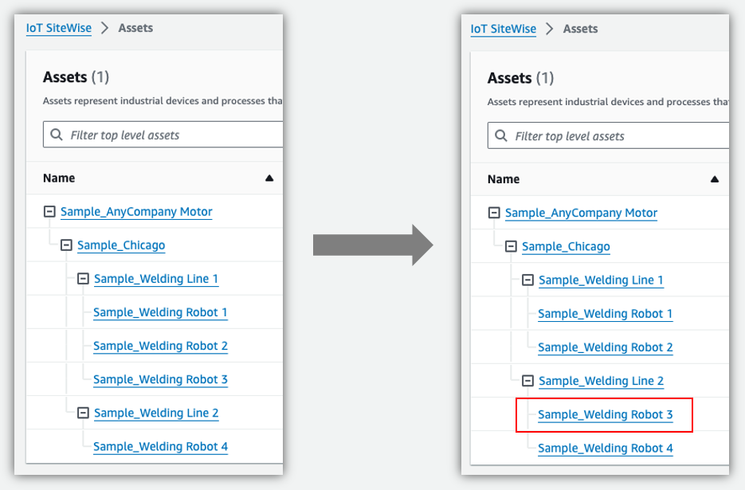
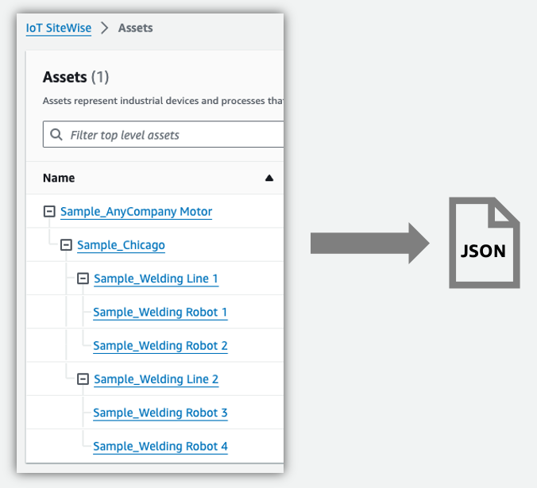

# Metadata Bulk Operations Sample for AWS IoT SiteWise

## Table of contents
1. [About this repo](#about-this-repo)
2. [Scenarios covered](#scenarios-covered)
3. [How does it work?](#how-does-it-work)
    1. [Bulk import](#bulk-import)
    2. [Bulk export](#bulk-export)
4. [Pre-requisites](#pre-requisites)
5. [How to use?](#how-to-use)
    1. [Configure](#1-configure)
    2. [Run bulk import scenarios](#2-run-bulk-import-scenarios)
    3. [Run bulk export scenarios](#3-run-bulk-export-scenarios)
6. [Clean up](#clean-up)

## About this Repo
AWS IoT SiteWise now [supports the bulk import, export, and update of industrial equipment metadata](https://aws.amazon.com/about-aws/whats-new/2023/11/aws-iot-sitewise-support-bulk-import-export-update-metadata/) for modeling at scale. These bulk operations are accessible through new API endpoints such as [CreateMetadataTransferJob](https://docs.aws.amazon.com/iot-twinmaker/latest/apireference/API_CreateMetadataTransferJob.html), [ListMetadataTransferJobs](https://docs.aws.amazon.com/iot-twinmaker/latest/apireference/API_ListMetadataTransferJobs.html), [GetMetadataTransferJob](https://docs.aws.amazon.com/iot-twinmaker/latest/apireference/API_GetMetadataTransferJob.html) and [CancelMetadataTransferJob](https://docs.aws.amazon.com/iot-twinmaker/latest/apireference/API_CancelMetadataTransferJob.html).

This repository provides code samples that allow you to explore the [bulk operations feature](https://docs.aws.amazon.com/iot-sitewise/latest/userguide/bulk-operations-assets-and-models.html) and understand its application in typical real-world customer scenarios.

## Scenarios covered
The table below outlines common scenarios for customers with industrial manufacturing facilities and how bulk operations can address their needs.

| Scenario | Operations involved
|:-|:-|
| Onboard initial asset models & assets | Bulk import
| Onboard additional assets | Bulk import
| Create new properties | Bulk import
| Fix manual errors | Bulk import
| Relocate assets | Bulk import
| Backup asset models and assets | Bulk export
| Promote asset models and assets to another environment | Bulk export & import
| Apply external identifiers | Bulk import
| Compose asset models | Bulk import

## How does it work?

The following steps explain the process involved in both bulk import and bulk export operations.

### Bulk import
1. Prepare a bulk definitions JSON file for SiteWise resources such as asset models and assets, following the [AWS IoT SiteWise metadata transfer job schema](https://docs.aws.amazon.com/iot-sitewise/latest/userguide/bulk-operations-schema.html), and upload this file to an Amazon S3 bucket.
2. Make a bulk import call to AWS IoT SiteWise, referencing the uploaded definitions JSON file.
3. AWS IoT SiteWise will import all the resources specified in the definitions JSON file.
4. Upon completion, AWS IoT SiteWise will return the status and a pre-signed S3 URL for any failures encountered.
5. In the event of failures, access the provided report to investigate and understand the root cause.

### Bulk export
1. Specify the asset models and assets to be exported, the destination S3 bucket, and initiate a bulk export call to AWS IoT SiteWise
2. AWS IoT SiteWise will export the definitions of all resources that meet the specified filtering conditions.
3. Download the exported definitions JSON file for further use.
4. Upon completion, AWS IoT SiteWise will return the status and provide a pre-signed S3 URL for any failures encountered.
5. In the event of failures, access the provided report to investigate and determine the root cause.

## Pre-requisites
1. Configure [AWS credentials](https://boto3.amazonaws.com/v1/documentation/api/latest/guide/credentials.html).
2. An S3 bucket to store the bulk definitions
3. To perform bulk operations, you must create an AWS Identity and Access Management (IAM) policy with permissions that allow the exchange of AWS resources between Amazon S3, AWS IoT SiteWise, and your local machine. Refer to [IAM permissions](https://docs.aws.amazon.com/iot-sitewise/latest/userguide/bulk-operations-prereqs.html#bulk-operations-prereqs-permissions).
4. Ensure Python 3.x is installed on your system, you can verify by running `python3 --version` or `python --version` (on Windows).
5. Clone this `Git` repository and install required Python packages by running `pip3 install -r requirements.txt`

## How to use?
### 1. Configure
Update `config/project_config.yml` to provide necessary information for the job.
* `s3_bucket_name`: Name of the S3 bucket where bulk definitions will be stored.
* `job_name_prefix`: Prefix to be used for the bulk operations jobs.

### 2. Run bulk import scenarios

#### Onboard asset models and assets
Create an initial asset hierarchy in AWS IoT SiteWise for an automotive manufacturing company.

`python3 src/import/main.py --bulk-definitions-file 1_onboard_models_assets.json`

#### Onboard additional assets
Create additional assets **Sample_Welding Robot 3** and **Sample_Welding Robot 4** and a new production line **Sample_Welding Line 2**.

`python3 src/import/main.py --bulk-definitions-file 2_onboard_additional_assets.json`

#### Create new properties
Add a new property **Joint 1 Temperature** to **Sample_Welding Robot** asset model.

`python3 src/import/main.py --bulk-definitions-file 3_onboard_new_properties.json`

#### Fix manual errors
Correct the serial number of **Sample_Welding Robot 1** by replacing the old serial number `S1000` with `S1001`.

`python3 src/import/main.py --bulk-definitions-file 4_fix_incorrect_datastreams.json`

#### Relocate assets
Re-arrange assets to adapt to changes in production line operations. Move **Sample_Welding Robot 3** asset to **Sample_Welding Line 2** production line.

`python3 src/import/main.py --bulk-definitions-file 5_relocate_assets.json`

#### Promote asset models and assets to another environment
Promote the resources from developement to QA environment. The definitions file such as [7_promote_to_another_environment.json](src/import/7_promote_to_another_environment.json) can be obtained using bulk export operation.

Redo the  [Pre-requisites](#pre-requisites) and [Configure](#1-configure) in your target account, then run the following command.

`python3 src/import/main.py --bulk-definitions-file 7_promote_to_another_environment.json`

#### Apply external identifiers
Apply external identifier to an existing asset, for example, **Sample_Welding Robot 4**.

`python3 src/import/main.py --bulk-definitions-file 8_apply_external_identifier.json`

#### Compose asset models
Compose **Sample_Welding Robot** asset model by independently modeling components in a welding robot such as robot joints. 

`python3 src/import/main.py --bulk-definitions-file 9_compose_models.json`

### 3. Run bulk export scenarios
#### Backup asset models and assets

You can backup all or specific resources using a bulk export operation. Learn more at [Running a bulk export job](https://docs.aws.amazon.com/iot-sitewise/latest/userguide/running-bulk-operations-export.html).

Replace <YOUR_ASSET_ID> in [6_backup_models_assets.json](src/export/6_backup_models_assets.json) with an asset ID of your choice.

Run the following to export the definitions of the given asset and all the assets below it in the hierachy.

`python3 src/export/main.py --job-config-file 6_backup_models_assets.json`

## Clean up
If you no longer require the solution, ensure you remove the resources to avoid incurring costs.

Run the following to remove all the asset models and assets created using this sample repository.

`python3 src/remove_sitewise_resources.py --asset-external-id External_Id_Company_AnyCompany`